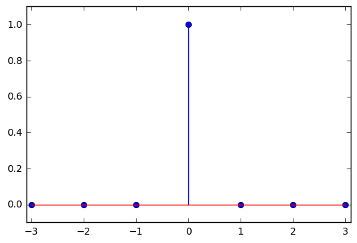

### Experiment Name: 

To Develop elementary signal function for unit sample, unit step, exponential and unit
ramp sequences.

#### Unit Sample

The definition of *unit Sample Seqence* is
$$
x[n] = \begin{cases}
    1 & \mbox{for $n = 0$} \\
    0 & \mbox{elsewhere}
  \end{cases}
$$

Let's implement *unit sample* by python code


```python
import numpy as np
import matplotlib.pyplot as plt

n = range(-3, 4, 1)
y = []
for i in range(len(n)):
    temp = (1 if n[i] == 0 else 0)
    y.append(temp)
    
plt.stem(n, y)
plt.axis([-3.1, 3.1, -0.1, 1.1])
plt.show()
```




